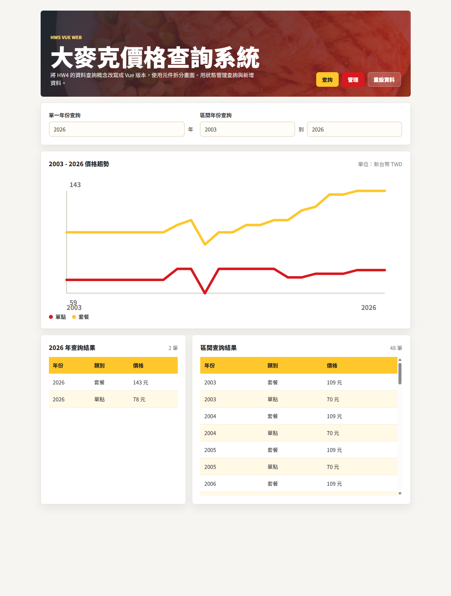
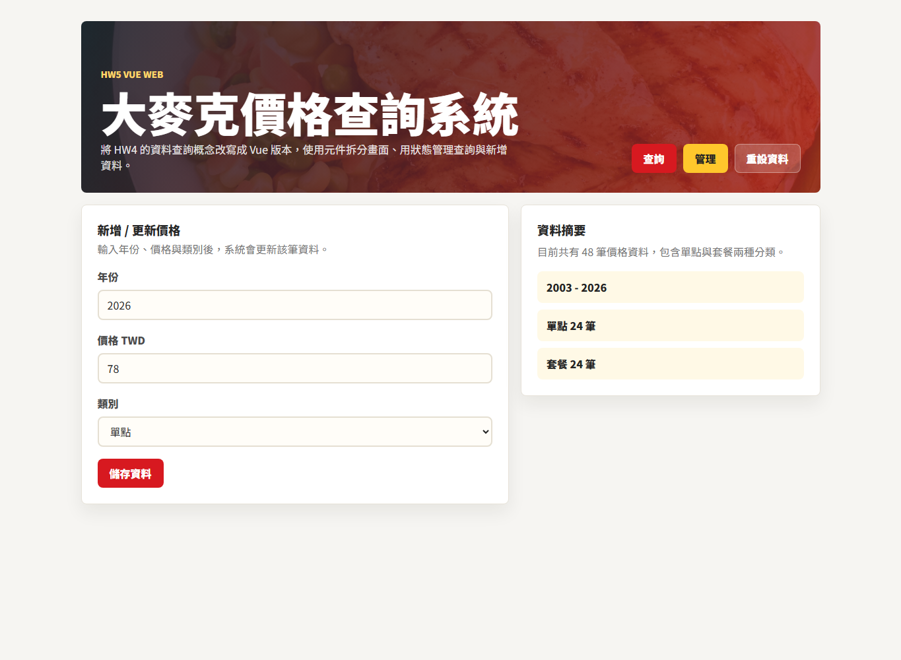

# HW5 Vue 大麥克價格查詢系統教學說明

本作業將大麥克價格資料做成 Vue 3 網站，使用 SFC（Single File Component）拆分畫面，讓 `index.html` 和 `main.js` 保持乾淨，只負責掛載 Vue App。

## 一、專案執行流程

### 1. 安裝套件

第一次開啟專案時，先在專案根目錄執行：

```bash
npm install
```

### 2. 啟動開發伺服器

```bash
npm run dev
```

啟動後，在瀏覽器打開：

```text
http://127.0.0.1:5173
```

### 3. 進入查詢畫面

首頁預設是「查詢」模式，可以輸入單一年份，也可以輸入起始年份與結束年份查詢區間資料。



### 4. 進入管理畫面

點擊右上角「管理」按鈕後，可以新增或更新某一年、某個類別的大麥克價格。



## 二、檔案整理方式

這次整理後，入口檔只保留必要內容。

`index.html` 只負責提供 Vue 掛載點：

```html
<div id="app"></div>
<script type="module" src="/src/main.js"></script>
```

`src/main.js` 只負責載入全域 CSS、建立 Vue App、掛載到 `#app`：

```js
import './assets/main.css'

import { createApp } from 'vue'
import App from './App.vue'

createApp(App).mount('#app')
```

實際畫面、資料處理與互動邏輯都放在 `src/App.vue`、`src/components` 和 `src/data`。

## 三、元件介紹

### 1. `AppHeader.vue`

負責網站最上方的標題區與主要功能按鈕。

它接收目前模式 `mode`，並透過事件通知父層切換頁面：

```vue
<AppHeader :mode="mode" @change-mode="mode = $event" @reset="resetData" />
```

### 2. `SearchControls.vue`

負責查詢條件輸入欄位。

包含：

- 單一年份查詢
- 區間年份查詢
- 起始年份與結束年份輸入

它使用 `v-model` 把使用者輸入同步回 `App.vue`：

```vue
<SearchControls
  v-model:single-year="singleYear"
  v-model:start-year="startYear"
  v-model:end-year="endYear"
  :min-year="START_YEAR"
  :max-year="END_YEAR"
/>
```

### 3. `PriceChart.vue`

負責顯示價格折線圖。

`App.vue` 先把資料整理成圖表需要的座標，再傳給 `PriceChart.vue` 顯示。紅線代表「單點」，黃線代表「套餐」。

```vue
<PriceChart :chart="chart" :from="rangeBounds.from" :to="rangeBounds.to" />
```

### 4. `PriceTable.vue`

負責顯示查詢結果表格。

同一個元件被使用兩次：

- 第一張表格顯示單一年份查詢結果
- 第二張表格顯示區間查詢結果

```vue
<PriceTable :title="`${singleYear} 年查詢結果`" :rows="singleResults" />
<PriceTable title="區間查詢結果" :rows="rangeResults" scrollable />
```

這樣可以重複使用同一個表格元件，避免在 `App.vue` 裡寫兩份類似的 table。

### 5. `ManagePriceForm.vue`

負責新增或更新價格的表單。

使用者輸入年份、價格與類別後，表單送出事件會回到 `App.vue` 的 `upsertPrice()` 函式處理。

```vue
<ManagePriceForm
  v-model:form="editForm"
  :categories="CATEGORIES"
  :message="message"
  :message-type="messageType"
  @submit="upsertPrice"
/>
```

### 6. `SummaryPanel.vue`

負責顯示目前資料摘要，例如資料總筆數、單點筆數、套餐筆數與年份範圍。

```vue
<SummaryPanel
  :total="sortedRows.length"
  :single-count="singleCount"
  :meal-count="mealCount"
  :start-year="START_YEAR"
  :end-year="END_YEAR"
/>
```

## 四、怎麼用元件構成網站

整個網站由 `App.vue` 統一組合。

`App.vue` 的工作是：

- 載入元件
- 載入大麥克價格資料
- 管理查詢年份、管理表單、提示訊息等狀態
- 用 computed 計算查詢結果與圖表座標
- 把資料透過 props 傳給子元件
- 接收子元件 emit 出來的事件

網站結構可以理解成：

```text
App.vue
├─ AppHeader.vue
├─ 查詢模式
│  ├─ SearchControls.vue
│  ├─ PriceChart.vue
│  └─ PriceTable.vue
└─ 管理模式
   ├─ ManagePriceForm.vue
   └─ SummaryPanel.vue
```

在查詢模式中，使用者修改年份後，`SearchControls.vue` 會把新年份同步到 `App.vue`，接著 `App.vue` 重新計算：

- `singleResults`
- `rangeResults`
- `chart`

然後畫面上的折線圖與表格就會自動更新。

在管理模式中，使用者送出表單後，`ManagePriceForm.vue` 只負責發出 submit 事件，真正更新資料的邏輯放在 `App.vue` 的 `upsertPrice()`。更新完成後，資料會存進 `localStorage`，重新整理頁面後仍能保留。

## 五、資料模組設計

價格資料放在：

```text
src/data/bigMacPrices.js
```

這個檔案負責：

- 設定年份範圍 `START_YEAR`、`END_YEAR`
- 設定資料分類 `CATEGORIES`
- 保存原始價格歷史資料
- 產生完整年份資料 `buildInitialData()`

把資料放到 `src/data`，可以避免把大量資料塞進 `main.js` 或 `index.html`，也讓 `App.vue` 更容易閱讀。

## 六、完成重點

本作業符合以下要求：

- `index.html` 保持乾淨，只放 Vue 掛載點與入口 script。
- `main.js` 保持乾淨，只載入 CSS、建立 Vue App 並掛載。
- 元件都設計在 `src/components` 目錄下。
- `App.vue` 使用 SFC 方式組織網站，透過元件組合完成畫面。
- 查詢、圖表、表格、表單與摘要區都有獨立元件。
- 文件包含執行流程、畫面截圖、元件介紹與網站組成方式。
